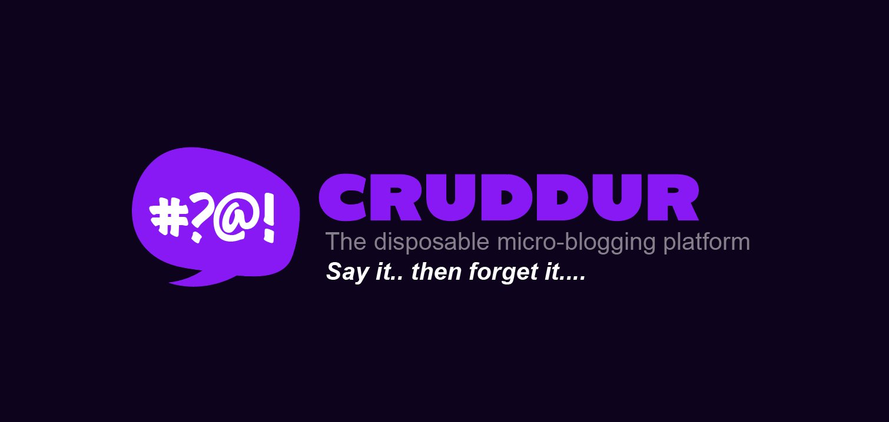

# Cruddur — FREE AWS Cloud Project Bootcamp

Cruddur is the starter application used for the FREE AWS Cloud Project Bootcamp.




**Cohort:** 2023-A1

## Contents
- About
- Quick start (run locally)
- Development workflow
- Deploying (production)
- Project structure
- Journaling homework
- Contributing

## About

This repository contains the full-stack Cruddur application used for hands-on labs during the bootcamp. It includes a Flask backend, a React frontend, helper scripts for building and deploying, and example AWS infra artifacts.

## Quick start

Prerequisites:
- Docker & Docker Compose (recommended)
- Git
- Optional: Python, Node.js, AWS CLI if running parts locally or deploying

Start the app locally using Docker Compose (builds and runs backend + frontend):

```bash
docker-compose up --build
```

Or run services individually:

- Backend (from `backend-flask`):

```bash
cd backend-flask
pip install -r requirements.txt
python app.py
```

- Frontend (from `frontend-react-js`):

```bash
cd frontend-react-js
npm install
npm start
```

## Development workflow

- Use the helper scripts under `bin/` to build, run, and deploy services:
	- `bin/backend/*` — backend scripts
	- `bin/frontend/*` — frontend scripts
	- `bin/*` generally contains convenience wrappers for Docker, ECR, and ECS tasks

- Backend code lives in [backend-flask](backend-flask)
- Frontend code lives in [frontend-react-js](frontend-react-js)

## Deploying (production)

This repo includes production-ready dockerfiles and compose config:
- `docker-compose.prod.yml` — production compose file
- `backend-flask/Dockerfile.prod` and `frontend-react-js/Dockerfile.prod`

Use the scripts in `bin/` to push images to ECR and deploy to ECS, or follow the instructions in the `aws/` folder for CloudFormation / task definitions.

## Project structure (top-level)

- `backend-flask/` — Flask API service, helpers, and DB scripts
- `frontend-react-js/` — React single-page app
- `aws/` — AWS related templates, policies, and lambdas
- `bin/` — developer scripts for build, deploy, and local helpers
- `docker/` — docker-related assets
- `journal/` — weekly journaling homework

## Journaling Homework

The `/journal` directory contains weekly prompts and entries used during the bootcamp. See the files linked below:

- [Week 0](journal/week0.md)
- [Week 1](journal/week1.md)
- [Week 2](journal/week2.md)
- [Week 3](journal/week3.md)
- [Week 4](journal/week4.md)
- [Week 5](journal/week5.md)
- [Week 6](journal/week6.md)
- [Week 7](journal/week7.md)
- [Week 8](journal/week8.md)
- [Week 9](journal/week9.md)
- [Week 10](journal/week10.md)
- [Week 11](journal/week11.md)
- [Week 12](journal/week12.md)
- [Week 13](journal/week13.md)


---
Updated README for clarity and quick onboarding.